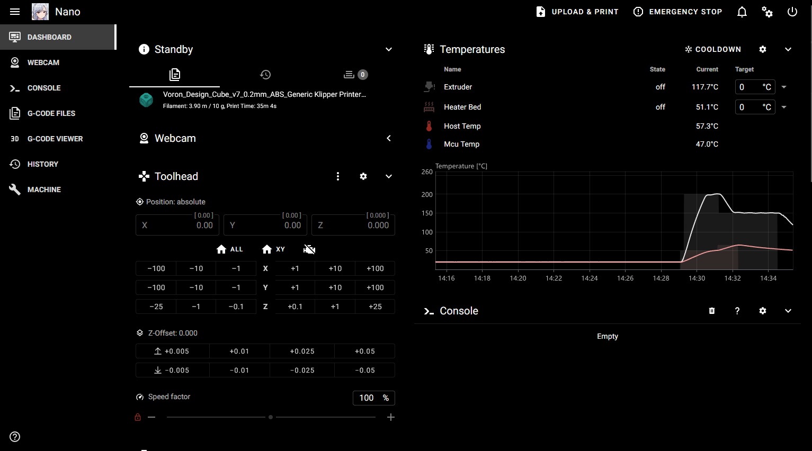
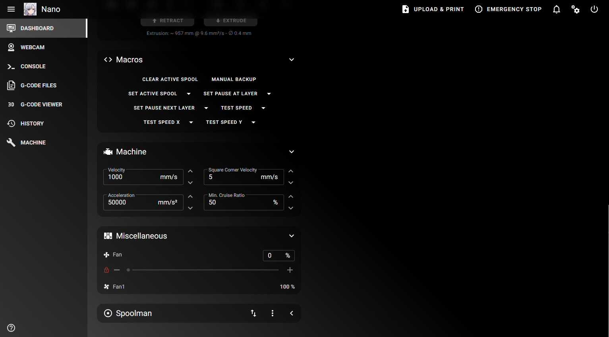
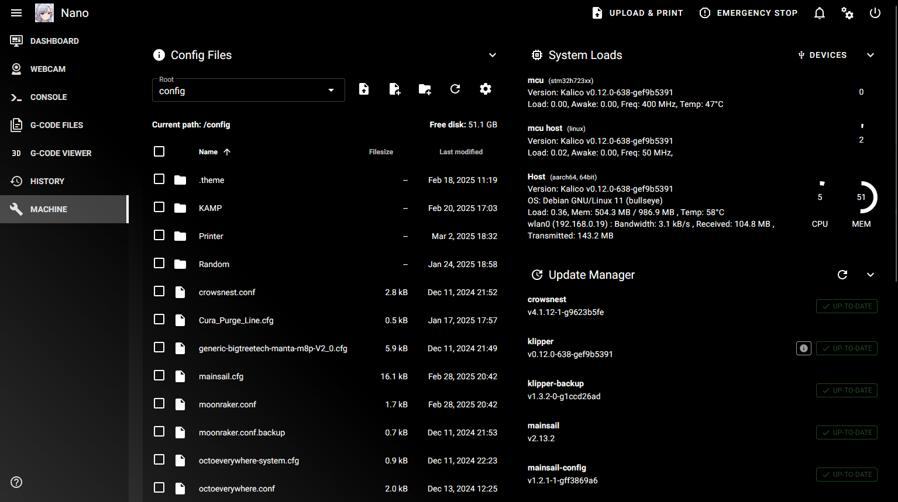

# Klipper-DarkContrastTheme





_________________________________________________
***Only tested on Mainsail***

Install any theme from kiauh and swap the custom.css found in .theme

OR

Delete the .theme and paste this into an ssh dialog:


```
git clone https://github.com/Suzu0071/Klipper-DarkContrastTheme ~/printer_data/config/.theme
```

If you use this somewhere, cite it with my ugly face c:

With love, from Suzuki

UwU
